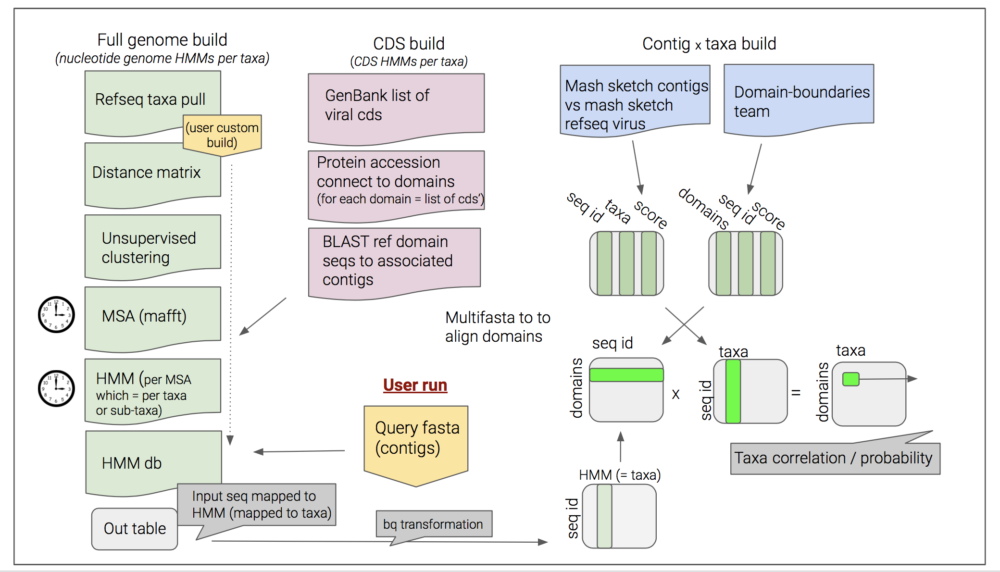

# Taxonomy_Domain_Integration


 

Write MASTER SCRIPT
  1. Fetch sequences
  2. Clustering
  3. Make HMM
  4. Map models to sequences
  5. Estimate taxonomy of sequences
      Mash
        Define p-value cut-off (-v)
  6. Combine tables
  

Generate a distance matrix for Clustering:

Two Wrapper scripts exist for generating distance matrices for unsupervised clustering of sequences. RWrapperA.sh makes use of GNU parallel tools, while RWrapperB.sh does not. Both scripts require a single multifasta file of nucleotide sequences, a matrix output, a names output file, and a PATH.

Usage for parallel implementation:
```
$ RWrapperA.sh <Seqs.fna> <matrixout> <namesoutput> <PATH>
```

Usage for non-parallel implementation:
```
$ RWrapperB.sh <Seqs.fna> <matrixout> <namesoutput> <PATH>
```

The distance matrix is natively output with rows and columns named by a unique integer which can be mapped to the names text file. This matrix can then be fed into the subsequent clustering approach


Unsupervized clustering for grouping similar genomes:

The distance matrix generated is provided as an input to `cluster_similar_fasta_sequences.py` along with the a list of names of sequences. An unsupervized clustering approach, based on PCA and K-means, is used to infer the clusters from the distance matrix. The python file also required the actual fasta sequences as an input, through a single multi-sequence fasta, and generates multiple fasta files, each of which contains the fasta sequences identified within a same cluster.

Usage:
```
$ python3 -d <distance_matrix_file> -n <names_file> -s <Seqs.fna> -o <out_dir>
```

The fasta files generated have filenames of the form input_files_#.fasta which can then be used directly for whole genome alignment or multiple sequence alignment

## Assign taxonomy to the contig sequences
We used Mash to search for the closest viral reference for each contig in the sample. We employed a p-value cutoff (0.05) to limit to top-matching references. 
```
VADIM script
```
We then linked taxonomic IDs to the identified references, and added SRR accession identifiers to all contigs to make them unique. 
```
python get_taxonomy_id.py ref_viruses_rep_genomes_v5.ids <file with the list files of mash distance>
```

