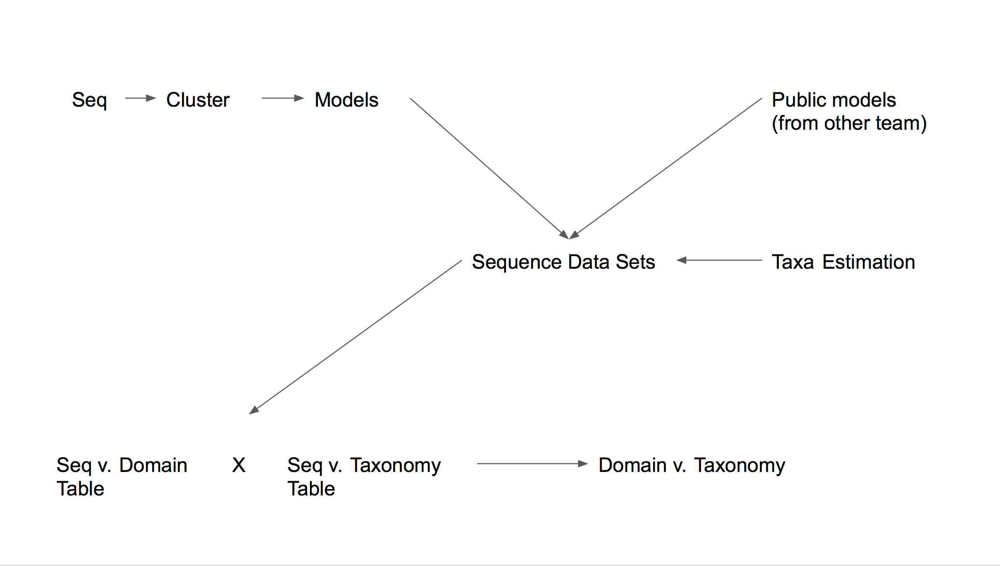
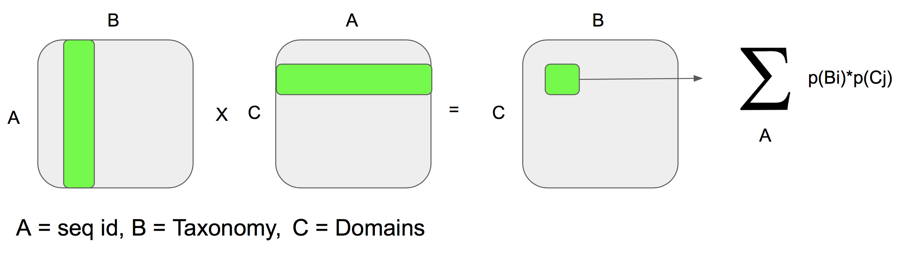

# Taxonomy_Domain_Integration


 

https://docs.google.com/presentation/d/1XBmCPwnyJttWEZb0vtMPxfsFuQV68UZU5FIr64T0tjs/edit#slide=id.p



Write MASTER SCRIPT
  1. Fetch sequences
  2. Clustering
  3. Make HMM
  4. Map models to sequences
  5. Estimate taxonomy of sequences
      Mash
        Define p-value cut-off (-v)
  6. Combine tables
  

Generate a distance matrix for Clustering:

Two Wrapper scripts exist for generating distance matrices for unsupervised clustering of sequences. RWrapperA.sh makes use of GNU parallel tools, while RWrapperB.sh does not. Both scripts require a single multifasta file of nucleotide sequences, a matrix output, a names output file, and a PATH.

Usage for parallel implementation:
```
$ RWrapperA.sh <Seqs.fna> <matrixout> <namesoutput> <PATH>
```

Usage for non-parallel implementation:
```
$ RWrapperB.sh <Seqs.fna> <matrixout> <namesoutput> <PATH>
```

The distance matrix is natively output with rows and columns named by a unique integer which can be mapped to the names text file. This matrix can then be fed into ... ... 

